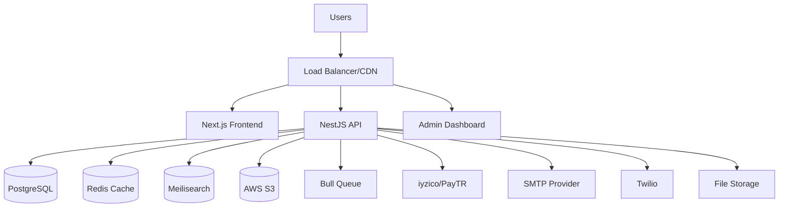
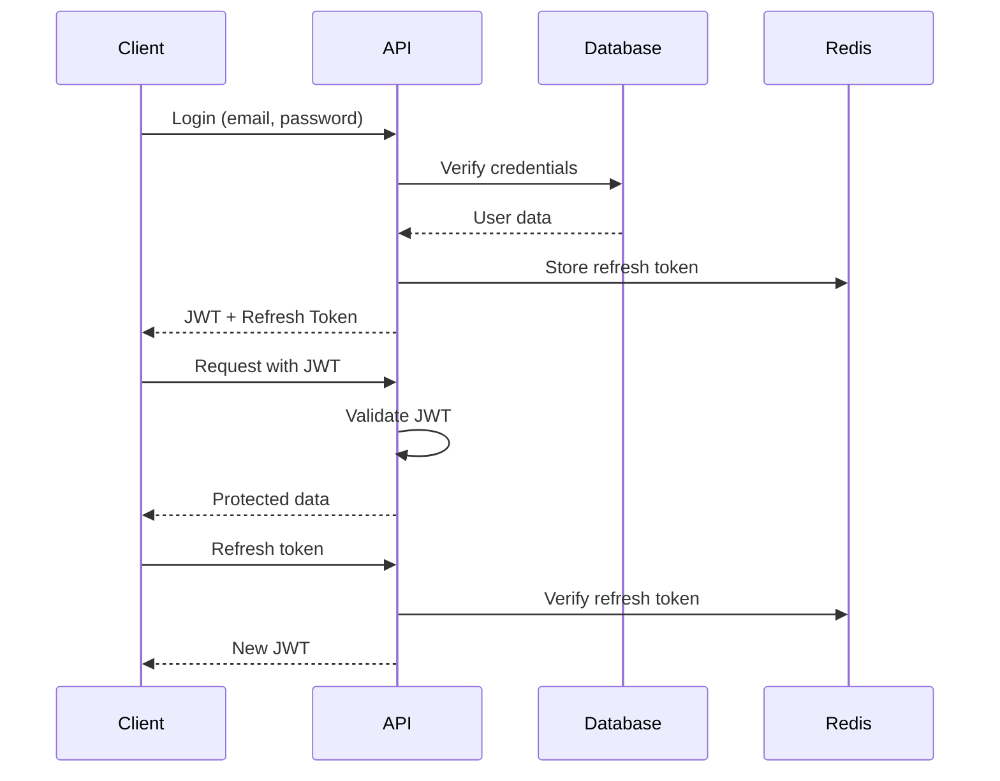
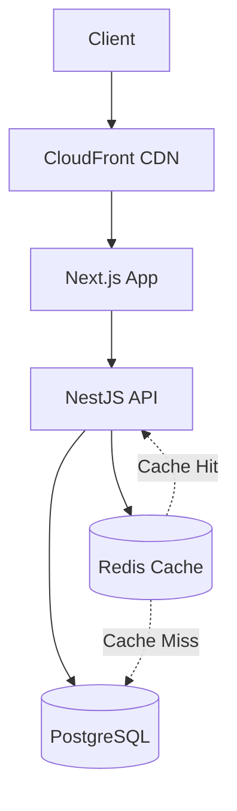
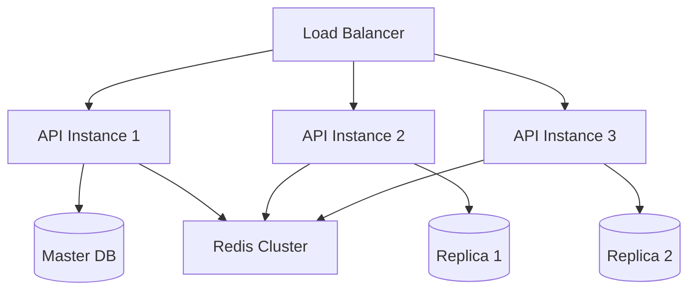

# Castlyo Platform Architecture

## 🏗️ Genel Mimari

Castlyo, modern web teknolojileri ile geliştirilmiş, ölçeklenebilir ve güvenli bir monorepo yapısına sahiptir.



## 📦 Teknoloji Yığını

### Frontend Stack
- **Framework:** Next.js 14 (App Router)
- **Language:** TypeScript
- **Styling:** Tailwind CSS + shadcn/ui
- **State:** React Query (SWR)
- **Forms:** React Hook Form + Zod
- **Auth:** NextAuth.js
- **Deploy:** Vercel/Docker

### Backend Stack
- **Framework:** NestJS
- **Language:** TypeScript
- **Database:** PostgreSQL + Drizzle ORM
- **Cache:** Redis
- **Search:** Meilisearch
- **Queue:** Bull + Redis
- **Auth:** JWT + Passport
- **Validation:** class-validator
- **API Docs:** Swagger/OpenAPI

### Infrastructure
- **Containerization:** Docker + Docker Compose
- **Reverse Proxy:** Nginx
- **CDN:** CloudFront/Cloudflare
- **Storage:** AWS S3
- **Monitoring:** Sentry + Winston
- **CI/CD:** GitHub Actions

## 🗂️ Proje Yapısı

```
castlyo/
├── apps/
│   ├── web/                 # Next.js Frontend
│   │   ├── src/
│   │   │   ├── app/         # App Router pages
│   │   │   ├── components/  # React components
│   │   │   ├── lib/         # Utilities
│   │   │   └── hooks/       # Custom hooks
│   │   └── public/          # Static assets
│   │
│   ├── api/                 # NestJS Backend
│   │   ├── src/
│   │   │   ├── modules/     # Feature modules
│   │   │   ├── common/      # Shared utilities
│   │   │   └── config/      # Configuration
│   │   └── test/            # Tests
│   │
│   └── admin/               # Admin Dashboard
│       └── src/             # Admin specific code
│
├── packages/
│   ├── ui/                  # Shared UI components
│   ├── database/            # Database schemas
│   ├── types/               # TypeScript types
│   └── config/              # Shared configs
│
└── docs/                    # Documentation
```

## 🛠️ Modüler Mimari

### Core Modules

#### 1. Authentication Module (`/auth`)
```typescript
AuthModule
├── controllers/
│   ├── auth.controller.ts       # Login, register, refresh
│   └── verification.controller.ts # Email/SMS verification
├── services/
│   ├── auth.service.ts          # Auth business logic
│   ├── jwt.service.ts           # JWT token management
│   └── verification.service.ts  # Verification logic
├── strategies/
│   ├── jwt.strategy.ts          # JWT validation
│   └── local.strategy.ts        # Local auth
└── guards/
    ├── jwt.guard.ts             # Route protection
    └── roles.guard.ts           # Role-based access
```

#### 2. Users Module (`/users`)
```typescript
UsersModule
├── controllers/
│   └── users.controller.ts      # User CRUD operations
├── services/
│   └── users.service.ts         # User business logic
└── dto/
    ├── create-user.dto.ts       # User creation validation
    └── update-user.dto.ts       # User update validation
```

#### 3. Talents Module (`/talents`)
```typescript
TalentsModule
├── controllers/
│   └── talents.controller.ts    # Talent profile management
├── services/
│   └── talents.service.ts       # Talent business logic
└── dto/
    └── talent-profile.dto.ts    # Profile validation
```

#### 4. Agencies Module (`/agencies`)
```typescript
AgenciesModule
├── controllers/
│   └── agencies.controller.ts   # Agency management
├── services/
│   └── agencies.service.ts      # Agency business logic
└── dto/
    └── agency-profile.dto.ts    # Agency validation
```

#### 5. Jobs Module (`/jobs`)
```typescript
JobsModule
├── controllers/
│   ├── jobs.controller.ts       # Job CRUD
│   └── applications.controller.ts # Applications
├── services/
│   ├── jobs.service.ts          # Job business logic
│   └── applications.service.ts  # Application logic
└── dto/
    ├── create-job.dto.ts        # Job creation
    └── application.dto.ts       # Application data
```

## 💾 Veri Modeli

### Core Entities

#### Users
```sql
users
├── id (UUID, PK)
├── email (VARCHAR, UNIQUE)
├── password_hash (VARCHAR)
├── role (ENUM: TALENT, AGENCY, ADMIN)
├── status (ENUM: PENDING, ACTIVE, SUSPENDED)
├── email_verified (BOOLEAN)
├── phone_verified (BOOLEAN)
├── created_at (TIMESTAMP)
└── updated_at (TIMESTAMP)
```

#### Talent Profiles
```sql
talent_profiles
├── id (UUID, PK)
├── user_id (UUID, FK)
├── first_name (VARCHAR)
├── last_name (VARCHAR)
├── bio (TEXT)
├── city (VARCHAR)
├── skills (JSONB)
├── portfolio_images (JSONB)
├── portfolio_videos (JSONB)
├── is_public (BOOLEAN)
└── boosted_until (TIMESTAMP)
```

#### Job Posts
```sql
job_posts
├── id (UUID, PK)
├── agency_id (UUID, FK)
├── title (VARCHAR)
├── description (TEXT)
├── job_type (ENUM)
├── city (VARCHAR)
├── age_min/max (INTEGER)
├── budget_range (VARCHAR)
├── status (ENUM)
├── max_applications (INTEGER)
└── expires_at (TIMESTAMP)
```

### İlişkiler
- **User → Profile:** 1:1 (talent_profiles, agency_profiles)
- **Agency → Jobs:** 1:N (job_posts)
- **Job → Applications:** 1:N (job_applications)
- **Application → Permission:** 1:1 (contact_permissions)

## 🔐 Güvenlik Mimarisi

### Authentication Flow


### Authorization Levels
1. **Public:** Ana sayfa, ilanlar
2. **Authenticated:** Profil, başvuru
3. **Role-based:** Talent/Agency özel alanlar
4. **Admin:** Yönetim paneli

### Data Protection
- **Encryption:** Bcrypt (passwords), AES-256 (sensitive data)
- **HTTPS:** TLS 1.3 enforced
- **CORS:** Restricted origins
- **Rate Limiting:** Per IP/User
- **Input Validation:** class-validator + Zod

## 📡 API Design

### RESTful Endpoints
```
/api/v1/
├── auth/
│   ├── POST /login
│   ├── POST /register
│   ├── POST /refresh
│   └── POST /logout
├── users/
│   ├── GET /me
│   ├── PATCH /me
│   └── DELETE /me
├── talents/
│   ├── GET /
│   ├── GET /:id
│   ├── POST /
│   └── PATCH /:id
├── jobs/
│   ├── GET /
│   ├── GET /:id
│   ├── POST /
│   └── POST /:id/apply
└── admin/
    ├── GET /users
    ├── GET /stats
    └── POST /moderate
```

### Response Format
```typescript
// Success Response
{
  success: true,
  data: T,
  message?: string
}

// Error Response
{
  success: false,
  error: string,
  message: string,
  statusCode: number,
  timestamp: string
}

// Paginated Response
{
  data: T[],
  pagination: {
    page: number,
    limit: number,
    total: number,
    totalPages: number,
    hasNext: boolean,
    hasPrev: boolean
  }
}
```

## 🚀 Performans & Ölçeklendirme

### Caching Strategy


#### Cache Layers
1. **CDN:** Static assets, images
2. **Application:** API responses, user sessions
3. **Database:** Query results, computed data

#### Cache Keys
```typescript
// User cache
"user:{userId}"
"user:profile:{userId}"

// Job cache  
"jobs:list:{filters}"
"job:{jobId}"
"job:applications:{jobId}"

// Search cache
"search:talents:{query}"
"search:jobs:{query}"
```

### Database Optimization
- **Indexing:** Primary queries optimized
- **Connection Pooling:** PgBouncer
- **Read Replicas:** Scaling read operations
- **Partitioning:** Large tables (audit_logs)

### File Storage
```
S3 Bucket Structure:
├── profiles/
│   ├── images/
│   └── videos/
├── jobs/
│   └── attachments/
└── documents/
    └── verification/
```

## 🔄 Event-Driven Architecture

### Message Queue System
```typescript
// Job Processing
export enum QueueNames {
  EMAIL = 'email',
  SMS = 'sms', 
  FILE_PROCESSING = 'file-processing',
  NOTIFICATIONS = 'notifications',
  ANALYTICS = 'analytics'
}

// Example: Email Queue
interface EmailJob {
  to: string;
  template: string;
  data: Record<string, any>;
  priority: number;
}
```

### Event Types
- **User Events:** registration, verification, profile_update
- **Job Events:** job_posted, application_submitted, application_reviewed
- **Payment Events:** payment_completed, subscription_expired
- **System Events:** maintenance_mode, feature_flag_changed

## 📊 Monitoring & Observability

### Logging Strategy
```typescript
// Log Levels
{
  error: 0,    // Critical errors
  warn: 1,     // Warnings
  info: 2,     // General info
  debug: 3,    // Debug info
  verbose: 4   // Detailed logs
}

// Log Format
{
  timestamp: "2024-01-01T00:00:00Z",
  level: "info",
  message: "User logged in",
  userId: "uuid",
  correlationId: "uuid",
  metadata: {}
}
```

### Metrics Collection
- **Application:** Response times, error rates
- **Database:** Query performance, connection pool
- **Cache:** Hit ratio, memory usage
- **Business:** User registrations, job applications

### Health Checks
```typescript
// Health Check Endpoints
GET /health
├── /health/db      // Database connectivity
├── /health/redis   // Cache connectivity
├── /health/storage // File storage
└── /health/queue   // Message queue
```

## 🔧 Development Workflow

### Git Flow
```
main
├── develop
├── feature/user-auth
├── feature/job-posting
├── hotfix/security-patch
└── release/v1.0.0
```

### CI/CD Pipeline
```yaml
# GitHub Actions
name: CI/CD Pipeline
on: [push, pull_request]

jobs:
  test:
    - Lint code
    - Type check
    - Unit tests
    - E2E tests
    
  build:
    - Build applications
    - Build Docker images
    - Security scan
    
  deploy:
    - Deploy to staging
    - Run smoke tests
    - Deploy to production
```

## 📈 Scaling Considerations

### Horizontal Scaling
- **API:** Multiple NestJS instances
- **Database:** Read replicas + sharding
- **Cache:** Redis cluster
- **Files:** CDN + multiple regions

### Vertical Scaling
- **Memory:** Optimize for large datasets
- **CPU:** Async processing, worker threads
- **Storage:** SSD, high IOPS

### Future Architecture


---

Bu mimari dokümantasyonu, Castlyo platformunun teknik altyapısını ve karar alma süreçlerini açıklamaktadır. Proje büyüdükçe bu dokümantasyon güncellenecektir.
